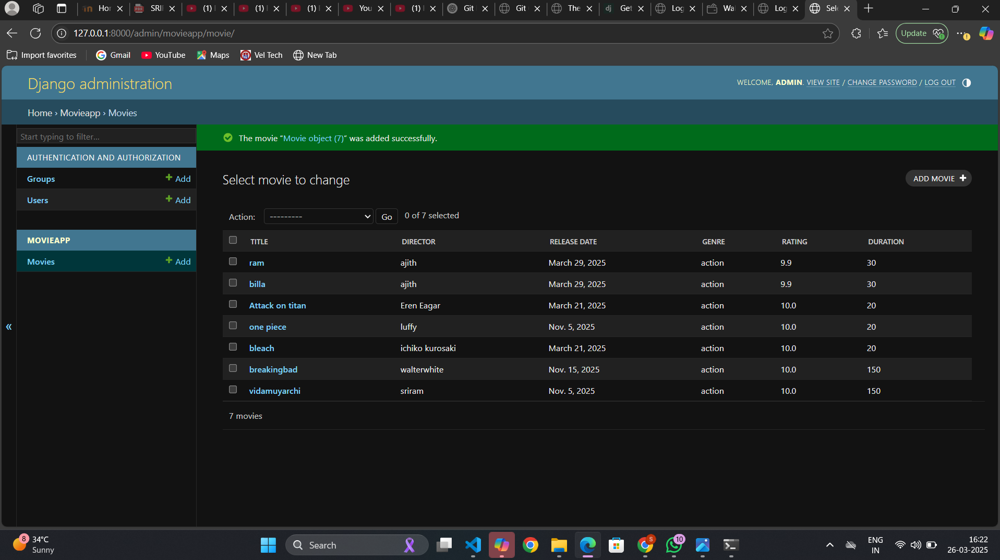

# Ex02 Django ORM Web Application

## Date: 26/03/2025

## AIM

To develop a Django application to store and retrieve data from a Movies Database using Object Relational Mapping(ORM).

## DESIGN STEPS

### STEP 1:

Clone the problem from GitHub

### STEP 2:

Create a new app in Django project

### STEP 3:

Enter the code for admin.py and models.py

### STEP 4:

Execute Django admin and create details for 10 books

## PROGRAM

```
Models.py:
from django.db import models
from django.contrib import admin
class Movie(models.Model):
    title = models.CharField(max_length=255, help_text="Movie Title")
    director = models.CharField(max_length=100, help_text="Director Name")
    release_date = models.DateField(help_text="Release Date")
    genre = models.CharField(max_length=50, help_text="Movie Genre")
    rating = models.DecimalField(max_digits=3, decimal_places=1, help_text="Movie Rating (e.g., 8.5)")
    duration = models.IntegerField(help_text="Duration in Minutes")

class MovieAdmin(admin.ModelAdmin):
    list_display = ('title', 'director', 'release_date', 'genre', 'rating', 'duration')

Admin.py:
from django.contrib import admin
from.models import Movie,MovieAdmin
admin.site.register(Movie,MovieAdmin)
```

## OUTPUT



## RESULT

Thus the program for creating movies database using ORM hass been executed successfully
